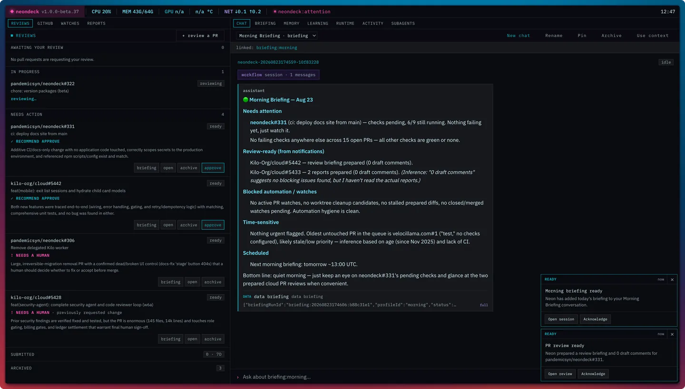
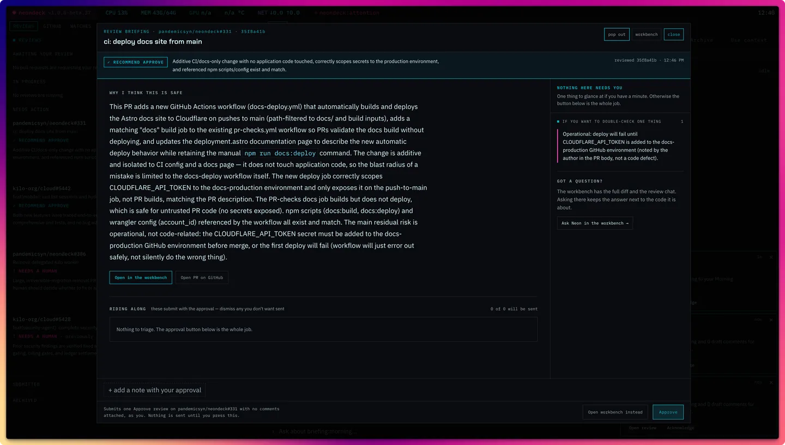
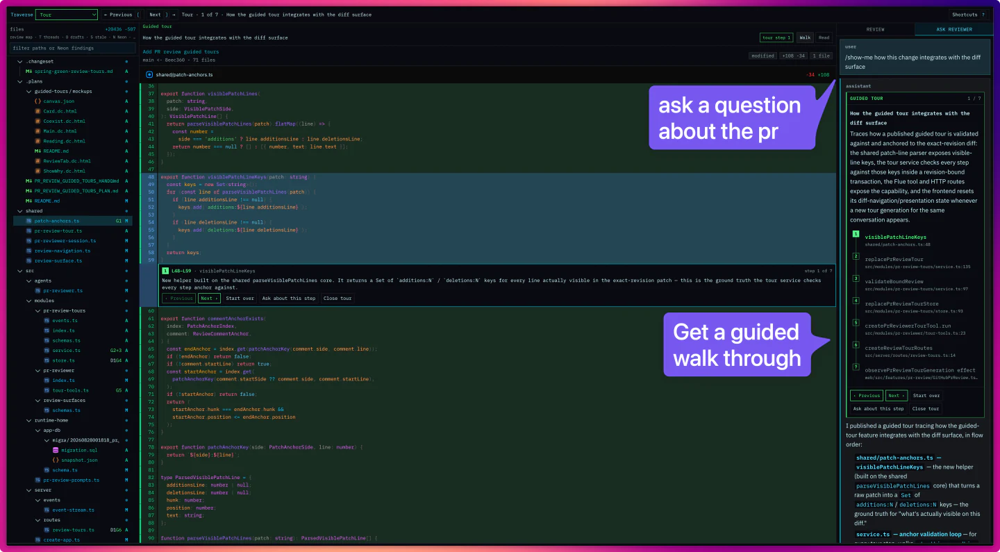

# neondeck

A note from me, the human:

- Is this vibe coded? 100% barely looked at the code. Its fine'ish.
- Should this maybe have been vanilla Pi? Probably. This started out life has just a little companion app i was gonna run on a DO.
- Does this do well with large diffs? 110% - use this to review 50k line pr's pretty regularly at day job.
- Is this a serious thing ? No, but it's turned out to be really fucking useful. We ship a lot at day job and I was drowning in reviews.

This thing does 3 things

1. Helps me review _alot_ of PRs without having to ever open up Github.
2. Manages my PR's for me. Kilo/codex hand off changes to Neon, and neon takes care of them through merge. Reviews are basically the only time I look at code at this point.
3. Sends me a morning briefing to help me keep up with the stuff all my EU coworkers have shipped. I use the Superhuman MCP and others to get a custom briefing.

## From the robots

A companion agent for keeping PRs moving, getting reviews done, and helping humans stay on task.

Neon watches your PRs, helps you get your reviews done, an tracks CI and release checks. It can configure its own repos,
schedules, models, and deck layout through typed tools and APIs.

It works with ChatGPT subs, as well as any gateway support by Pi (Kilo gateway, open router, etc)

It is especially useful on a companion display, vertical panel, or Corsair
Xeneon Edge-style display, where your active work can stay visible without taking
over your editor or primary agent chat.

The backend is Node 26, Hono, and Flue; the dashboard is Vite, React, and Tailwind. Neondeck can run on your machine or on a remote host, with
mutable state stored in SQLite under a runtime home you control.

## Factory intake and planning

Open `/factory` to enable the opt-in local inbox and create manual tasks. Admitted
tasks receive bounded utility-model triage automatically. Choose **Ask Neon to
plan** to shape a model-proposed brief in a dedicated persistent conversation,
then reply to revise it or edit the draft manually. Compare retained versions,
discuss a section, and resolve decisions before releasing an exact specification
version. GitHub connections can admit signed issue events and reconcile full source
content and attributed replies. A separate webhook listener keeps the dashboard
on loopback. GitHub publishing is off by default: explicitly enable one maintained
status comment, approve a version-bound public summary, or preview and send an exact
question. Ambiguous sends and remote edits have visible recovery paths. Released
tasks await a coding executor; no coding, PR creation, merge or deployment runs.
These factory changes are in an open stacked delivery; deployed acceptance is pending.

See the [manual intake operator guide](.plans/factory/INCREMENT_1_OPERATOR.md) and
[planning operator guide](.plans/factory/INCREMENT_2_OPERATOR.md), plus the
[human shaping guide](.plans/factory/INCREMENT_3_OPERATOR.md) and
[GitHub intake operator guide](.plans/factory/INCREMENT_4_OPERATOR.md) and
[GitHub publishing guide](.plans/factory/INCREMENT_5_OPERATOR.md).

## The deck in action

Neon puts the work queue, an actionable morning briefing, and the relevant
conversation on the same screen.



When a PR is ready/reviewed, you get a recommendation on whether or not it requires a human look. The PR briefing gives you fast way to eval if
you really want to review this or if this change is safe to stamp and approve.



The focused workbench keeps the revision-aware diff, review actions, and a
reviewer conversation together—without moving the work to GitHub's web UI. It
is also fast as fuck, even with giant PRs.

Guided PR tours turn a reviewer question into an exact-revision, line-anchored
walkthrough. Neon traces the flow across files while the diff annotation,
traversal controls, and reviewer-side step list stay synchronized—so you can
inspect a cross-file change, ask follow-up questions, and never lose your place.



[See how guided PR tours work](https://neondeck.dev/docs/guided-tours/).

## Built for work in progress

Neon watches PRs, prepares fixes and reviews, and keeps things moving.

- **Your PRs, with CI status at a glance.** See open PRs across your repos in
  one panel, with live check status and stale-work flags.
- **Watch a PR without losing feedback.** Watch polling records complete review,
  conversation, requested-change, commit, and check facts with semantic
  fingerprints. Current feedback can be processed on the first poll or baselined
  explicitly. Meaningful feedback and failing checks now reuse one continuing
  owner and managed worktree. Autopilot can notify, prepare a reviewable commit,
  wait for approval in that same owner conversation, or deliver automatically
  when the owner judges the change reasonable, appropriately scoped, and
  sufficiently validated.
- **Trace a change with guided PR tours.** Ask Neon to show you a flow, behavior,
  or finding and get a durable walkthrough anchored to the exact PR revision.
  Walk the steps in the diff or switch to a stitched reading view that preserves
  tour order across files. Tours explain the code without masquerading as review
  findings, and a new tour replaces the old one atomically so the current
  walkthrough always matches the conversation.
- **Review and approve PRs on the deck.** Read diffs, leave inline comments,
  resolve threads, traverse files, hunks, drafts, threads, and revision-bound
  Neon findings, and submit approvals or change requests without switching to
  github.com. Findings can be dismissed locally or explicitly promoted into
  the existing draft/revision workflow without silently submitting anything.
  Neon reviews against an exact-head, read-only Git workspace. The reviewer
  discovers the merge-base diff itself, can inspect bounded patches, raw files,
  hunk indexes, history, and blame at the reviewed revisions, and keeps a durable
  chat available for follow-up questions.
- **Handoff, both directions.** Delegate work to agents like Kilo or Codex, then
  let the finished PR come back to Neon for checks and deployment follow-through.
- **Conversational briefings and scheduled instructions.** Neon grounds a
  durable Morning Briefing conversation in an inspectable local snapshot, then
  can enrich it with any relevant configured MCP source under normal login and
  approval controls. Follow up in chat, or run your own saved prompt on a timer.
- **Scoped execution for each job.** Keep code-changing work in managed
  worktrees, use approval policy for ordinary chat and scheduled operations, give the
  trusted Autopilot coding owner a repository-native workspace with a
  credential-free default environment, or run mediated work on an `exe.dev`
  sandbox VM.
- **Memory that learns from your work.** Neon turns conversations and PR
  outcomes into typed, validated, audited, reversible memory and skill
  improvements. Safe writes apply automatically by default; explicit
  `review` and `off` modes keep autonomy operator-controlled.
- **Ask Neon to set up the deck.** Configure repos, models, schedules, layout,
  and display behavior through typed tools instead of hand-editing every file.

## Project shape

- `src/`: Hono/Flue backend, agents, tools, app-owned operations, persistence, metrics,
  CLI, and runtime-home setup.
- `web/`: Vite, React, and Tailwind dashboard for the local companion display.
- `docs/`: Astro marketing/docs site deployed to Cloudflare for
  [neondeck.dev](https://neondeck.dev).
- `config/`: checked-in defaults copied into new runtime homes.
- `SOUL.md`: default personality/context material for Neon.

## Quick start

Use Node 26.4.0 or newer.

```sh
npm install
npm run init
npm run dev
```

Open `http://127.0.0.1:5173/`.

The setup wizard prepares a runtime home, configures KiloCode, OpenAI API-key,
Anthropic, OpenRouter, OpenCode Zen, Google Vertex AI Gemini, ChatGPT
subscription, or custom OpenAI-compatible model access, and offers searchable
model catalogs for KiloCode, OpenRouter, OpenCode, and Vertex. Vertex uses Pi's
bundled Gemini catalog and accepts either a Google Cloud API key or Application
Default Credentials with a project and location. It also checks the Git identity used by
Autopilot commits, adds local repositories,
applies a dashboard preset, and can create initial schedules and command
preapprovals. When the global Git identity is incomplete, the wizard warns and
offers to configure it instead of allowing Git to silently invent one from the
local account and hostname. Complete author and committer overrides persisted in
the runtime-home `.env` are also accepted; temporary shell exports do not
suppress the setup warning.

ChatGPT login/logout and provider registration changes made with the standalone
CLI apply after Neondeck restarts. Generic endpoint URLs are user-owned setup:
configure them with `neondeck init` or the local access-controlled dashboard/API,
not through model-callable tools.

## Runtime home

Mutable local state lives outside the source tree. Neondeck resolves runtime
home in this order:

```text
NEONDECK_HOME
XDG_CONFIG_HOME/neondeck
~/.config/neondeck
```

That home contains local secrets, runtime config, repo registration, dashboard
layout, schedules, skills, and separate SQLite databases for Neondeck app state
and Flue runtime state.

## Common commands

```sh
npm run dev              # local backend + dashboard
npm run cli -- status    # runtime readiness and configured paths
npm run cli -- auth status openai-codex # ChatGPT subscription status
npm run cli -- doctor    # local diagnostics
npm run check            # fast local verification
npm run test:integration # slower operation/worktree coverage
npm run build            # production dashboard/server + docs build
npm run docs:astro-dev   # hot dev server for the docs site
```

After a production build or package install, start Neondeck and open the
dashboard:

```sh
neondeck open
```

When no login service is installed, `open` owns the server in the current
terminal; press Ctrl-C to stop it. Or install the macOS or Linux login service
for managed background operation:

```sh
neondeck service install
neondeck open
```

Use `serve` when you want the foreground server without opening a browser:

```sh
neondeck serve
```

To launch a named window profile with Chromium app-mode placement, select the
browser executable explicitly:

```sh
neondeck open sidebar --browser "/path/to/chromium"
neondeck open xeneon --browser "/path/to/chromium"
```

## Documentation

- [neondeck.dev](https://neondeck.dev): public site and product docs.
- [Getting started](https://neondeck.dev/docs/getting-started/): install,
  secrets, runtime home, dashboard launch, and local app install.
- [Upgrading](https://neondeck.dev/docs/upgrading/): update npm, release archive,
  or source installations and restart the local service safely.
- [`QA.md`](./QA.md): install and validate published npm releases on a
  persistent Linux QA host.
- [Configuration](https://neondeck.dev/docs/configuration/): runtime config,
  models, providers, repos, schedules, SOUL, and skills.
- [Agent runtime](https://neondeck.dev/docs/agent-runtime/): Flue agents,
  tools, app-owned operations, memory, watches, reports, and scheduled tasks.
- [Autopilot](https://neondeck.dev/docs/autopilot/): watched-PR modes,
  semantic autonomous judgment, delivery guards, and fail-closed recovery.
- [Execution environments](https://neondeck.dev/docs/execution/): local and
  sandboxed execution policy.
- [MCP servers](https://neondeck.dev/docs/mcp/): MCP registration, OAuth, tool
  policy, and approvals.
- [Contributing](https://neondeck.dev/docs/contributing/): roadmap workflow,
  checks, reviews, and PR expectations.
- [Development](./DEVELOPMENT.md): repo-local setup, checks, builds, packaging,
  docs deployment, and publishing notes.

## Status

The roadmap lives in
`.plans/ROADMAP.md`; it is the source of truth for implementation order and
near-term priorities.

## License

MIT
